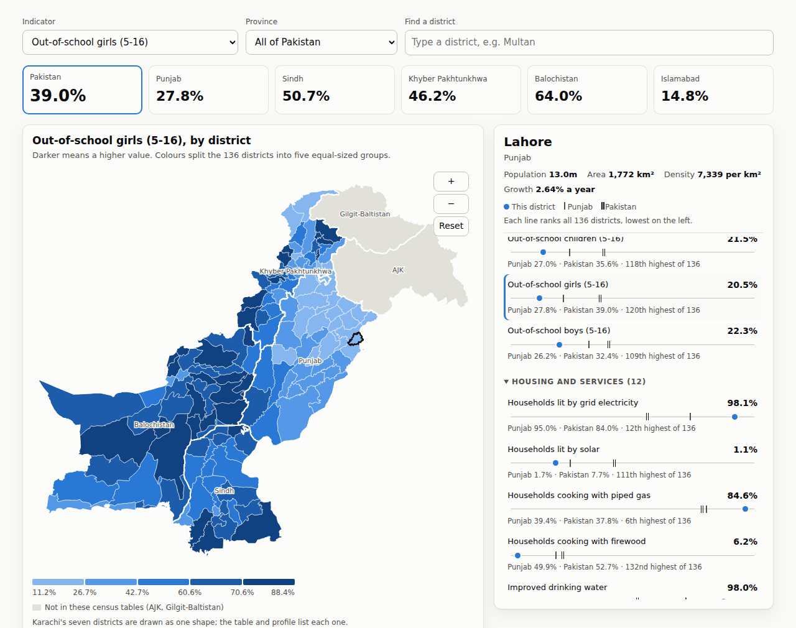
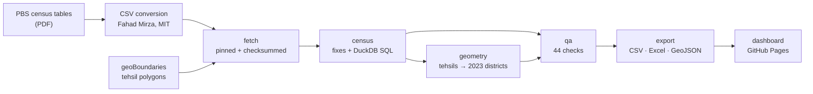

# Pakistan district data: Census 2023

[](https://github.com/shehroz-iqbal/pakistan-district-data/actions/workflows/ci.yml)
**[Open the live dashboard →](https://shehroz-iqbal.github.io/pakistan-district-data/)**

Pakistan's 2023 census publishes district results as hundreds of PDF tables. This project turns
ten of them into one clean, validated, documented dataset for all 136 districts. It also rebuilds
the 2023 district boundaries, which no open boundary file provides. Everything is published as
CSV, Excel, GeoJSON and an interactive map.



## Results worth knowing

- **Reproduces PBS's own published figures from district data.** Population 241,499,431;
  literacy 60.65% (men 68.00%, women 52.84%); out-of-school children 35.60%; urban share
  38.88%; all five province populations. **44 automated checks, all passing**
  ([QA report](data/processed/QA.md)).
- **Found and fixed errors in the public CSV conversion it builds on.**
  - Table 1 misspells Tando Allahyar, so the district drops out of every join.
  - A sub-district row is labelled as a district, overstating Sindh's population by 272,427.
  - Table 13a has 143 blank cells (Lahore's 5-16 population among them); the pipeline uses
    Table 13b, which agrees with 13a on every count the two share.
- **Rebuilds 2023 district boundaries** by assigning 554 tehsil polygons to districts:
  - 426 by exact name
  - 37 by close spelling
  - 26 by parent district
  - 27 reviewed by hand, each with a written reason

  The rebuilt areas match PBS's reported areas with a median ratio of 1.003.

## How it works



| Step | Code | What it does |
|---|---|---|
| fetch | `pipeline/fetch.py` | Downloads each source at a pinned upstream commit and refuses any file whose SHA-256 has changed. |
| census | `pipeline/census.py`, `sql/` | Applies the documented fixes, then builds a district table, a counts table and every indicator in DuckDB SQL. It computes districts, provinces and Pakistan in one `GROUPING SETS` query, from summed counts rather than averaged rates. |
| geometry | `pipeline/geometry.py` | Matches tehsil polygons to 2023 districts, dissolves them, checks areas against PBS and simplifies shared borders as a coverage. |
| qa | `pipeline/checks.py`, `pipeline/qa.py` | Runs reconciliation, identity, cross-table, completeness and geometry checks, then writes the QA report. |
| export | `pipeline/export.py` | Writes the published files, the dashboard data and the data dictionary. |

GitHub Actions rebuilds everything from scratch on every push. The build fails if a check fails,
or if the committed outputs differ from a fresh build (builds are byte-reproducible).

## Quick start

```bash
pip install -r requirements.txt
make data     # fetch pinned sources, build, check, export (about 15 seconds)
make test     # 54 tests: every data check plus unit tests
make serve    # dashboard at http://localhost:8000
```

## Outputs (`data/processed/`)

| File | Contents |
|---|---|
| `district_indicators.csv` | One row per district, one column per indicator (28). |
| `pakistan_district_indicators_2023.xlsx` | The same, for Excel users: plain-English headings, province and Pakistan rows, a definitions sheet. |
| `indicators_long.csv` | Every indicator for every district, province and Pakistan, with numerator, denominator and coverage. |
| `district_counts.csv` | The raw counts every indicator is built from. |
| `districts.csv` | District list with stable IDs and census spellings. |
| `districts_2023.geojson`, `provinces_2023.geojson` | Rebuilt 2023 boundaries (WGS84, simplified for web). |
| `QA.md`, `qa_district_area_check.csv` | Check results and the boundary area comparison. |

Indicators cover population (density, urban share, growth, sex ratio, disability), education
(literacy and out-of-school children, by sex) and housing and services (electricity, solar,
cooking fuel, water, toilets, tenure, crowding, and women's ownership of dwellings). Definitions
are in the [data dictionary](docs/data_dictionary.md).

## Documentation

- [Methodology](docs/methodology.md): sources, every correction and how it was found, how
  indicators and boundaries are built, and known limitations.
- [Data conventions](docs/conventions.md): how data here is stored, named, versioned and
  shared, and how to add a source or an indicator.
- [Data dictionary](docs/data_dictionary.md): every column in every published file (generated).

## Repository layout

```
config/       sources + lock file, corrections, indicator catalogue, PBS reference figures
crosswalks/   hand-reviewed tehsil overrides, Karachi map unit, generated assignment table
pipeline/     fetch, census, geometry, checks, qa, export
sql/          DuckDB transformations
data/         processed outputs (raw downloads are rebuilt, not committed)
site/         dashboard (HTML, CSS, JavaScript + D3)
tests/        pytest suite
docs/         methodology, conventions, data dictionary
```

## Credits and licences

- **Pakistan Bureau of Statistics**: the census figures.
- **[Fahad Mirza](https://github.com/fahad-mirza/pakistan_census_2023_tables)**: converted the
  PBS PDF tables to CSV (MIT). This project uses that conversion unchanged and applies its
  corrections downstream.
- **[geoBoundaries](https://www.geoboundaries.org/)**: tehsil polygons (ODbL 1.0), from which
  the district shapes are rebuilt.
- **D3** draws the dashboard.

Code is MIT (`LICENSE`); data licences and attribution are in [`DATA_LICENSE.md`](DATA_LICENSE.md).

## How this was built

Built by Shehroz Iqbal, using Claude (Anthropic) as a coding assistant. Nothing is taken on
trust, whether it comes from a source file, from me or from the assistant. Sources are pinned
and checksummed, and every correction must touch an expected number of rows. Every output is
reconciled against figures PBS publishes, and CI proves a fresh build reproduces the committed
files exactly.
